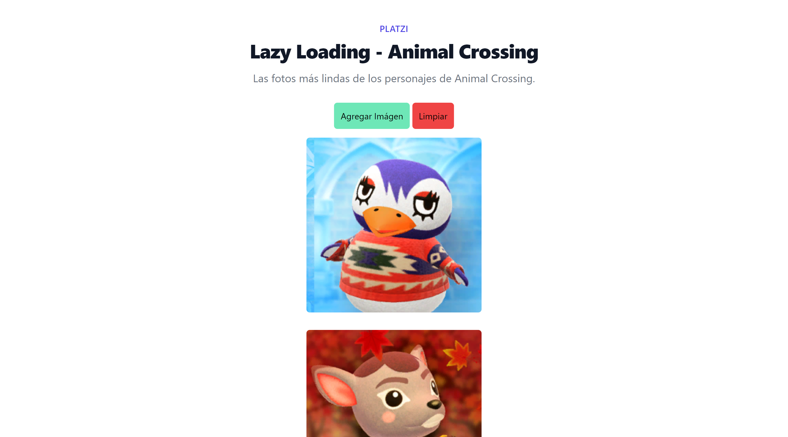

# Lazy Loading - Animal Crossing

## About the project

This project was built to put into practice the basics about DOM manipulation in JavaScript.  
Template: https://github.com/jonalvarezz/snowpack-template-tailwind  
API: http://acnhapi.com/  

Live: https://rodedd.github.io/avocado-market/

### Built with

- HTML
  - Semantic HTML
- CSS
  - Grid
  - Flexbox
- JavaScript
  - Vanilla JS
  - DOM Manipulation
  - Fetch API
  - Async / Await